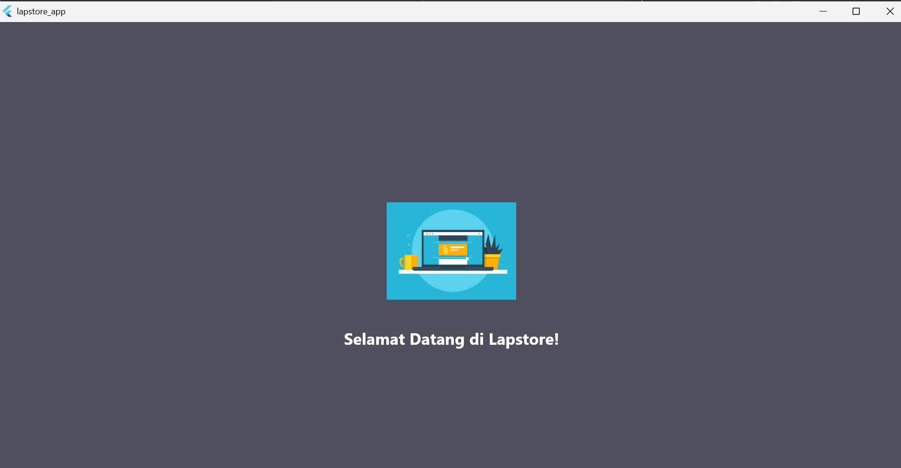
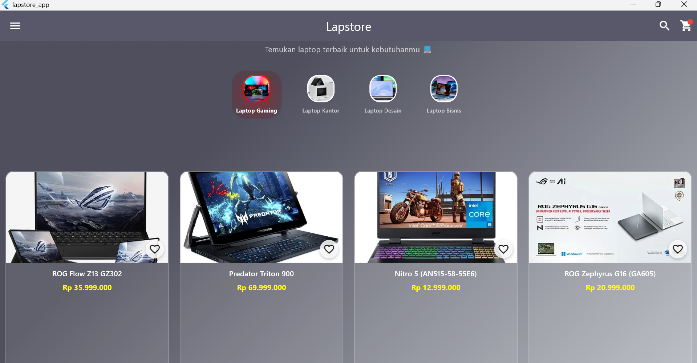
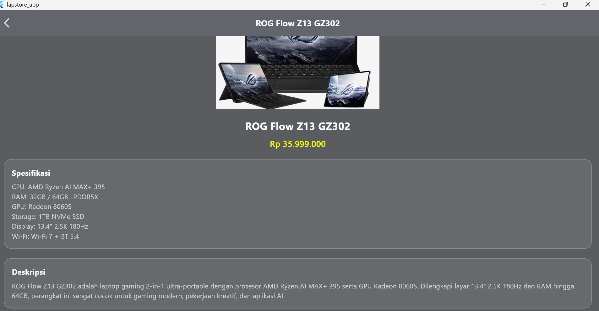
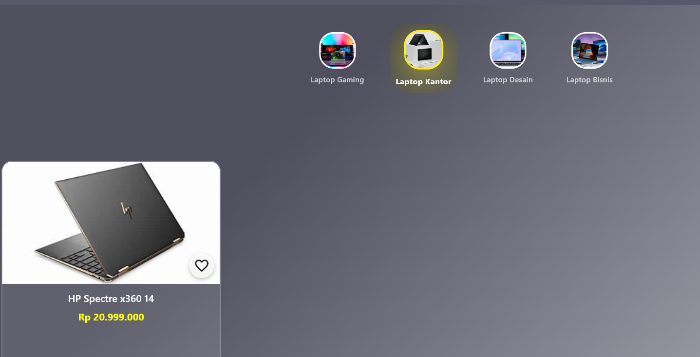
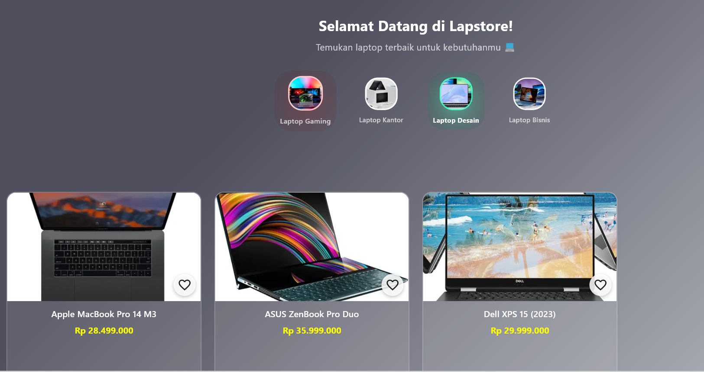
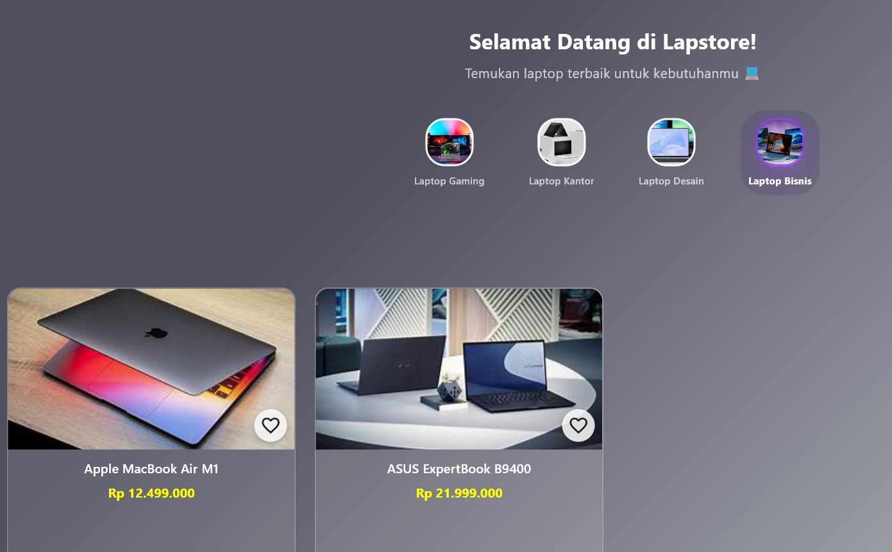

# 📱 UTS Mobile Programming 2  
## Judul Aplikasi: **LapStore** 💻

### 👩‍🎓 Identitas Mahasiswa
- **Nama Anggota Kelompok:**  
 1. Aqila Yufaridza (232101079)  
 2. Caca Cahyadi (232101058)  
 3. Rahmat Hardiansyah (232101072)  
- **Kelas:** TIF RP 23G  
- **Mata Kuliah:** Pemrograman Mobile 2  
- **Dosen Pengampu:** Niken Riyanti, ST.

---

### 📖 Deskripsi Aplikasi
Aplikasi **LapStore** adalah aplikasi katalog sederhana yang menampilkan produk laptop. Fitur utama aplikasi:  

- Menampilkan daftar produk laptop menggunakan **GridView**  
- **Custom Widget** (`ProductCard`) untuk tiap item  
- Animasi transisi dengan **Hero** & **AnimatedScale**  
- **StatefulWidget** untuk fitur **Favorite** dan kategori aktif  
- **Splash Screen** saat pertama kali aplikasi dijalankan  

---

### 📂 Link Google Drive (Laporan + Video Demo)
[Laporan + Video Demo LapStore](https://drive.google.com/drive/folders/1oWxVn_z3TJhanIcaDX726o7y75oAdgmM?usp=sharing)  

---

### 🖼️ Tampilan Aplikasi

#### 1. Splash Screen

#### 2. Halaman Beranda (Home Page)

#### 3. Detail Produk

| Laptop Gaming | Laptop Kantor | Laptop Desain |  
|---------------|---------------|---------------|  
|  |  |  |  

| Laptop Bisnis |  
|---------------|  
|  |  

---

© 2025 - Kelompok LapStore | Teknik Informatika | Universitas Teknologi Bandung
